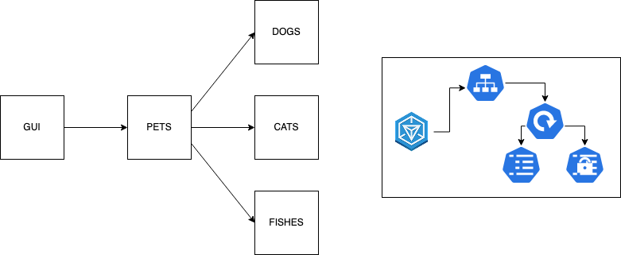
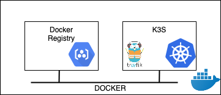
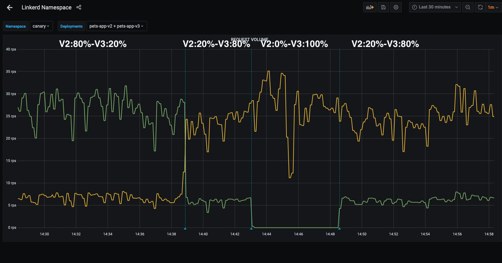

# MicroPet

## Overview

MicroPet is a MicroService Application that includes 4 components:

* `Dogs` is a service managing dogs (Go)
* `Cats` is a service managing cats (Go)
* `Fishes` is a service managing fishes (Go)
* `Pets` is a front ends service managing cats,dogs & fishes (Go)
* `Gui` is a frontend of the wonderfull application (Angular)

All the services are built into a Docker Images
All the service have deployed in a Kubernetes Cluster following the pattern:

Ingress <--> Service <--> Deployement <--> {ConfigMap,Secrets}



Note: All the procedure has tested only on Mac using

* Docker For Mac
* [K3D](https://k3d.io/) / [K3S](https://k3s.io/)
* Helm
* Traefik

## Setup the infrastructure

### New Docker Registry

Create a new Docker Registry locally  using docker using `registry.local` as DNS name.

```bash
$ ./k3s/new-docker-registry.sh
```

Edit your local hostname config /etc/hosts

```bash
127.0.0.1 registry.local
```

### Test the registry

```bash
docker pull containous/whoami
docker tag  containous/whoami registry.local:5000/containous/whoami:latest
docker push registry.local:5000/containous/whoami:latest
```

### New K3S Cluster

Create new K3S cluster using the docker registry created previously.
It deploys [Helm](https://helm.sh/) & [Traefik](https://doc.traefik.io/traefik/).  

Edit `k3s/new-local-cluster.sh` and set the value for

* CLUSTER_NAME
* K3S_HOME

```bash
$ k3s/new-local-cluster.sh
```

### Test k3s configuration

Apply the following configuration

```bash
kubectl apply -f k3s/test-k3s-traefik-contif.yaml
```

and check with your browser you can connect to `https://localhost:80/whoami/` or running

```bash
curl -k https://localhost:80/whoami/
```




## Deployments

### Deploy the Dev environment

```bash
kubectl apply -f k8s/resources-dev.yaml
kubectl delete -f k8s/resources-dev.yaml
```

#### Deploy

```bash
K8S_NS='default'
kubectl apply -f dogs/k8s/resources-dev.yaml -n ${K8S_NS}
kubectl apply -f cats/k8s/resources-dev.yaml -n ${K8S_NS}
kubectl apply -f fishes/k8s/resources-dev.yaml -n ${K8S_NS}
kubectl apply -f pets/k8s/resources-dev.yaml -n ${K8S_NS}
kubectl apply -f gui/k8s/resources-dev.yaml -n ${K8S_NS}
```

open the website

```bash
open http://gui.dev.pet-cluster.demo/
````

#### Modify the frontend

* edit  `gui/src/app/pets/pets.component.css` and change one color
* commit your code
* run `cd gui && make docker-build k8s-deploy`

the Makefile handles :

* the build of the Angular application
* the build of the Docker Image,
* the deployment into the Kubernetes Cluster

#### Undeploy

```bash
K8S_NS='default'
kubectl delete -f dogs/k8s/resources-dev.yaml -n ${K8S_NS}
kubectl delete -f cats/k8s/resources-dev.yaml -n ${K8S_NS}
kubectl delete -f fishes/k8s/resources-dev.yaml -n ${K8S_NS}
kubectl delete -f pets/k8s/resources-dev.yaml -n ${K8S_NS}
kubectl delete -f gui/k8s/resources-dev.yaml -n ${K8S_NS}
```

### Switch pets configuration

Switch between 2 services (dogs & cats) and 3 services (dogs, cats & fishes).

It uses the [kustomize](https://kustomize.io/) to generate the config map and to link it to the deployment.

```bash
cd pets
kubectl delete -k ./kustomize/overlays/2
kubectl apply -k ./kustomize/overlays/2
kubectl apply -k ./kustomize/overlays/3
kubectl apply -k ./kustomize/overlays/2
```

### New environment : test

Target an existing namespace (test) and modify the Ingress resources to use `test` in it.

It uses the [kustomize](https://kustomize.io/) 

* to generate the config map,
* to manage the namespace name,
* to change the Ingress URL (from .*dev*.pet-cluster.demo to .*test*.pet-cluster.demo)

```bash
kubectl create ns test
kustomize build  kustomize/test | sed "s/DEV/TEST/g" | sed "s/pets.dev.pet-cluster.demo/pets.test.pet-cluster.demo/g" | kubectl apply -f -
open http://gui.test.pet-cluster.demo/
kustomize build  kustomize/test | kubectl delete -f -
```

### Progressive deployment on Prod

Target an existing namespace (prod) and modify the Ingress resources to use `prod` in it.

```bash
kubectl create ns prod
kustomize build  kustomize/prod | sed "s/DEV/PRODUCTION/g" | sed "s/pets.dev.pet-cluster.demo/pets.prod.pet-cluster.demo/g" | kubectl apply -f -
# the pet application returns dogs & cats
open http://gui.prod.pet-cluster.demo
kubectl apply -f kustomize/prodfish/resources-dev-3.yaml -n prod
# the pet application returns dogs & cats & FISHES ==alternatively==
open http://gui.prod.pet-cluster.demo
kubectl delete -f kustomize/prodfish/resources-dev-2.yaml -n prod

# the pet application returns dogs & cats & FISHES
open http://gui.prod.pet-cluster.demo

kustomize build  kustomize/prod | kubectl delete -f -
```

Use a dedicated configuration to have the 2 versions of the pets implementation (one with fish, one without)

## Canary Deployment using Traefik

```bash
kustomize build kustomize/canary | sed "s/DEV/CANARY/g" | sed "s/pets.dev.pet-cluster.demo/pets.canary.pet-cluster.demo/g" | kubectl apply -f -
```

open http://pets.canary.pet-cluster.demo/

Inject traffic using [slow_cooker](https://github.com/BuoyantIO/slow_cooker)

```bash
./slow_cooker_darwin -qps 100 http://pets.canary.pet-cluster.demo/
````

After few minutes apply `kustomize/canary/pets_activate_20_80.yaml` to have V2 service (20%) and V3 service (80%)
After few minutes apply `kustomize/canary/pets_activate_00_100.yaml` to have V3 service (100%)

if linkerd has been installed you can look at the Grafana Dashbord showing 1/5 of the requests to the _pets_ service  goes to v3 including the fishes.

```bash
linkerd dashboard &
linkerd -n canary stat deploy
```




## Reference

* https://blog.stack-labs.com/code/kustomize-101/
* https://kubectl.docs.kubernetes.io/references/kustomize/
* https://tasdikrahman.me/2019/09/12/ways-to-do-canary-deployments-kubernetes-traefik-istio-linkerd/
