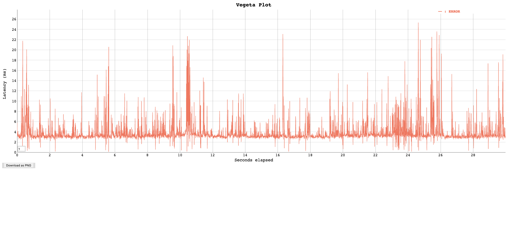

# VEGETA HTTP load

## description

this folder contains a http injector based on the (Vegeta HTTP injector)[https://github.com/tsenart/vegeta] project.

The `vegeta-http-runner.yaml` define a POD with 3 containers
* the `vegeta-container` container manages the injection. You can configure it througth the following environment variables
    * MAX_LOOP : number of the loop
    * VEGETA_DURATION: the duration of the vegeta attack (eg 60s for sixty seconds)
    * VEGETA_RATE: the rate of the vegeta attack
    * PAUSE_WAIT: the pause between 2 attacks in seconds (eg 10 will pause during ten seconds).
    * The `vegeta-http-targets` config map helps you to list the targets.
* the `httpd` container manages the expositions of the output resultd /plot_xxxx.html where xxxx is the number of the attemtps
* the `debian` container manages the index.hml file :-)

```
kubectl apply -f vegeta-http-runner.yaml
```

## Get the data

Expose the `vegeta-service` through an ingress of a kube-foward command 

```
http://localhost:50151/plot_10.html
```

